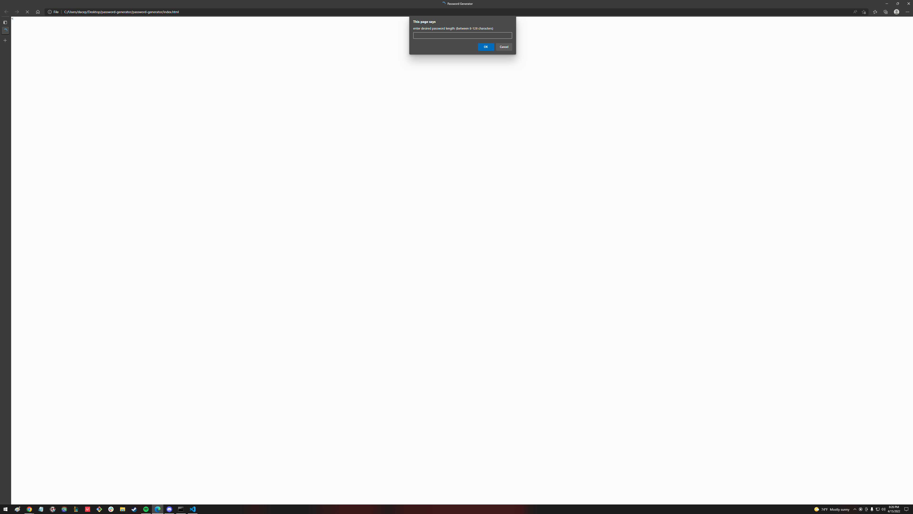
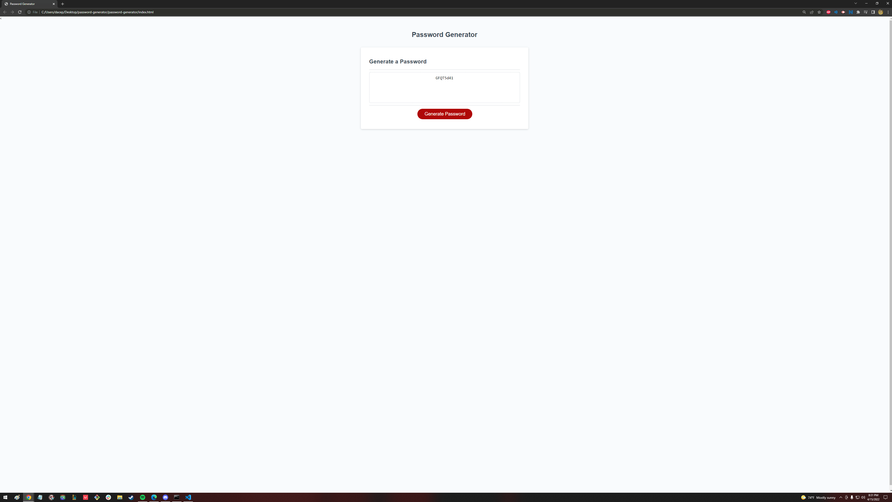

# password-generator

Hi 👋, this projects purpose is to not only to generate a randomized password, but to base it off the users criteria to generate said password using prompts.

## 💪 Challenges

some of the challenges I faced during this project were:

- creating the logic for the "for loop"
- connecting the prompts to the for loop
- and last but not least actually generating the password with the users prefered criteria

while hard I was able to overcome it by:
- refering to the text
- asking for help
- and good ole' fashion google

## 📸 Screenshots

### Entering desired Password length

### Getting a desired generated password based off your criteria! 
